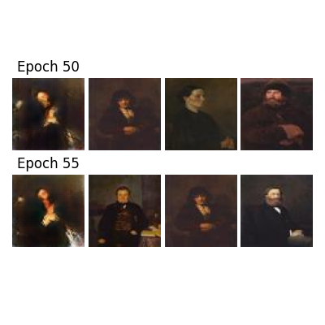

# ArtGAN: An Implementation

In this project, we implement the convolutional networks described in 
the paper from Tan, Chan, Aguirre & Tanaka [1]. However, we have made some 
changes to the original networks by adding Dropout layers, Instance noise 
and by tweaking the training parameters. Thus, ArtGAN lead us to interesting 
results, from generating unique faces to imitating well-known artists.

Please refer to the following sections for more information:

1. [Usage](#package-usage)
2. [Documentation](#documentation)
3. [Results](#our-results)

This project was made in collaboration with Maximilian Sabayev.

## Package usage

The networks are gathered in the *src/gan* folder. Also, there are three 
main files used for training and evaluating ArtGANs, 
and one utils file.

### Preparing data

At first, you should prepare the dataset that you want to use:
- *CIFAR-10*: everything is handled by the program
- *Wikiart*: download the [dataset](https://github.com/lucasdavid/wikiart/), 
extract it in the *data* folder, the csv files should already be in *src/datasets*
- *Your own dataset*: create a new folder in the *data* folder, implement 
a new Dataset class and add the option in all the files 

In order to accelerate training, data is expected to be resized prior 
to training. To that extent, the file *src/datasets/convert_data.py* allows 
to resize data
automatically. Here is the needed command:

`python src/datasets/convert_data.py <folder> [options]`

- `-r`: use it with any number if your folder **does not** contain subfolders, 
thus you should not use this option for Wikiart
- `-i`: use it if you want an image size different from 64
- `-f`: use it if the format of your images is different from jpg

### Training your ArtGAN 

Once you have downloaded and resized your data, you can use the *src/main.py* 
file to train an ArtGAN. Here are the command specifications:

`python src/main.py <data_type> [options]` 

- `-v`: you can select a version name for your ArtGAN 
- `-d`: you can choose the duration of the training (in epochs)
- `-r`: you can choose an epoch from which the program will continue training 
- `-l`: use it with any number if you want to save the loss of both networks 
- `-s`: use it with any number if you want to save the specificity of the Discriminator 

At the end of the training, saved models and images are available in the 
*results* folder. The program will also show up some 
images generated by the last model. 

### Evaluating your ArtGAN 

Once you have trained your ArtGAN, you can run multiple functions to evaluate it. 
For instance, the *src/project.py* file can be used: 

`python src/project.py <data_type> <version> <mode> [options]` 

- `<mode>`: you can choose from *loss*, *score*, *both*, *evolution* 
and *all*. If you do use *evolution* or *all*, you are expected to give three 
new arguments, namely the starting and ending epochs and the step.

The file *src/nnsearch.py* can also be used to plot the nearest 
neighbors of different generated images. Use it as follows:

`python src/nnsearch.py <data_type> [options]`

- `-v`: the version of your ArtGAN
- `-a`: the starting epoch 
- `-e`: the ending epoch 
- `-s`: the step in epochs 
- `-n`: the number of images to draw for each class 
- `-k`: the number of nearest neighbors to keep track of 

These different functions are completed by the fact that you can 
generate as many images as you want, just by running the main file 
with a retrain option and 
no duration. 

## Documentation

A complete documentation is available in the *doc* folder. If it is not
generated, you can run from the root folder:

`python -m pdoc -o doc/ --html src/`

Then, open index.html in your browser and follow the guide!

## Our results

Firstly, we used a toy dataset in order to find the best parameters for 
our ArtGAN. This is the French politicians dataset. Then, we used CIFAR-10 
and Wikiart datasets to create artworks. 

### French politicians faces 

Our dataset was created by combining 1.200+ squared or round lockets 
of French politicians. On the left, these are original images of the dataset 
and on the right, generated ones. 

Here, we show the resulting evolution of the specificity 
of the Discriminator (in green) and the loss of both the Generator (in blue) 
and the Discriminator (in red): 

### Wikiart artist 

On the left from up to down, the images are artworks corresponding to Eugene 
Boudin, Martiros Saryan and Vincent van Gogh labels. On the right, some generated 
images using these labels. 

Here, we show the specificity of the Discriminator (in green) and the loss of both 
the Generator (in blue) and the Discriminator (in red): 

Here, we show some nearest neighbors for Claude Monet label:

### Wikiart genre 

On the left from up to down, the images are artworks corresponding to Illustration, 
Portrait and Religious painting labels. On the right, some generated images using 
these labels.

Here, we show the specificity of the Discriminator (in green) and the loss of both 
the Generator (in blue) and the Discriminator (in red): 

Here, we show some nearest neighbors for Portrait label:

### CIFAR-10 

On the left from up to down, the images correspond to Frog, Horse and Boat labels. 
On the right, some generated images using these labels.

 

Here, we show the specificity of the Discriminator (in green) and the loss of both 
the Generator (in blue) and the Discriminator (in red): 

Here, we show some nearest neighbors for Boat label: 

## References

[1] Wei Rei Tan, Chee Seng Chan, Hernan E. Aguirre, Kiyoshi Tanaka. 
**ARTGAN: ARTWORK SYNTHESIS WITH CONDITIONAL CATEGORICAL GANS**.
